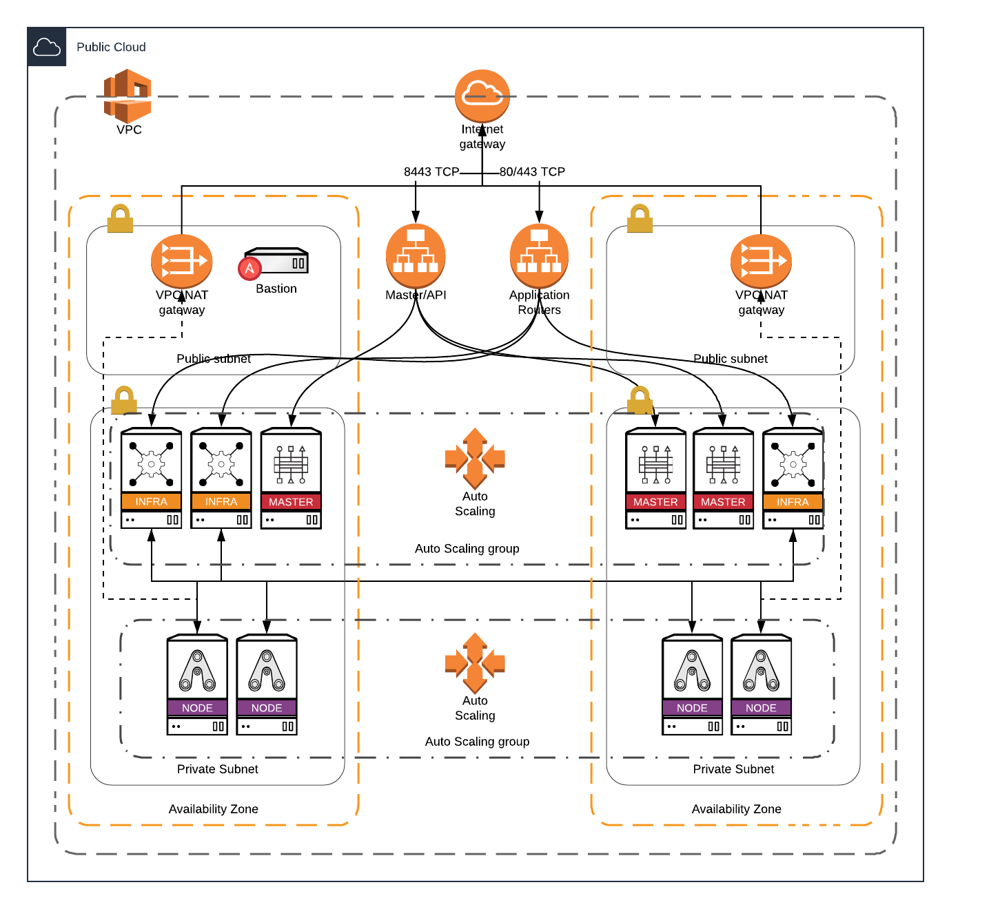
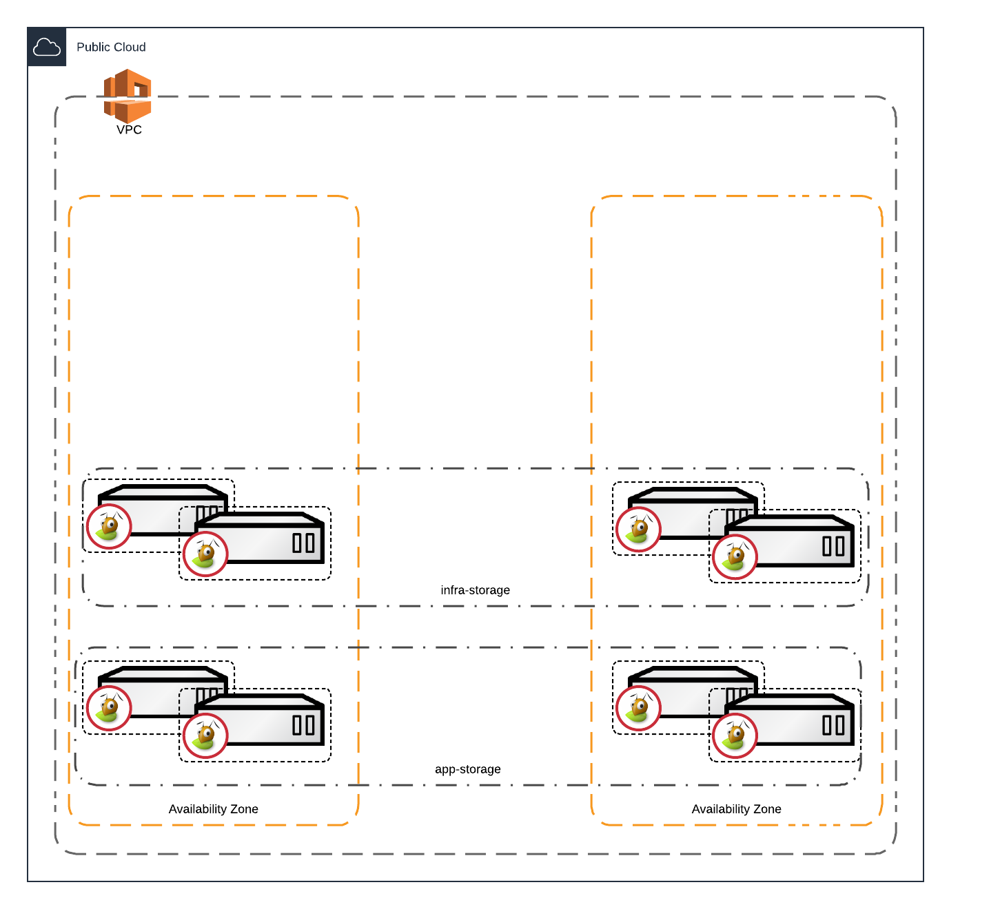

# OCP3-on-AWS-GovCloud
Deploy Red Hat's OpenShift Container Platform 3 in AWS GovCloud

Status:  Just started.  Don't expect anything cool yet.

## Overview
This Repo will chronical:
* Onboarding - GovCloud (MFA, IAM user, Access Keys)
* Research - OpenShift Container Platform 3 on AWS (which is a commerical/public cloud initiative)
* Design and Architecture Overview
* Artifacts and IaC  - to deploy the solution
* Deployment and Provisioning 
* Account Limits - configuring constraints/limits in my account (billing)
* Teardown - decommision the solution (to save $$)

## Onboarding - Signup for GovCloud
Contrary to popular belief, you do not need to be a "Goverment" to get a GovCloud account.  There *are* some additional hoops you have to jump through, but the process is fairly easy and straight-forward.

[Sign Up for GovCloud](GovCloud-Signup.md)  
*WARNING:*  AWS recommends, and I concur, that you setup a new AWS account dedicated to your GovCloud endevours.

## Research - OpenShift 3 on AWS
[Red Hat OpenShift on AWS - QuickStart](https://aws.amazon.com/quickstart/architecture/openshift/)  

[Getting Started with AWS Credits](https://aws.amazon.com/quickstart/architecture/openshift/get-started/)

## Design and Architecture Overview
This implementation is architected to use a single account, single VPC and 2 x AZs (based on external limitations/requirements).  While not ideal, I feel fairly confident that an entire AZ is not going to go down.

## Deployment and Provisioning 
Terraform will deploy the Infrastructre as Code (initially).  This will provide a more cloud-neutral approach.

## Account Limits 
(Complete this later)

## Unfold the sheet of paper

## References
I am going to create a separate doc for the references
[References](References.md)
